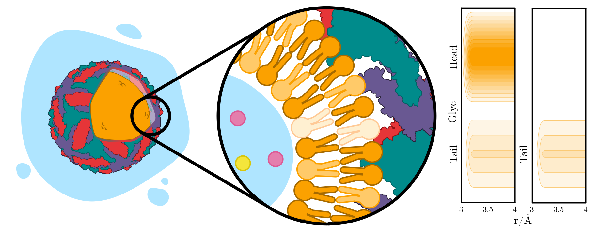

# Supplementary Information of _Lipid Architecture in the Zika Virus_

[](https://github.com/tcvmilvv/TavaresSonoraPantanoMartinez2025.jl/actions/workflows/CI.yml?query=branch%3Amain)

Camila Assis **Tavares**<sup>1,2</sup>, Martín **Soñora**<sup>3</sup>, Sergio **Pantano**<sup>3</sup>, Leandro **Martínez**<sup>1,2</sup>

<span style="font-size:0.8em">
<sup>1</sup> Institute of Chemistry, Universidade Estadual de Campinas (UNICAMP), Campinas, SP, Brazil <br>
<sup>2</sup> Center for Computational Engineering & Science, Universidade Estadual de Campinas (UNICAMP), Campinas, SP, Brazil <br>
<sup>3</sup> Biomolecular Simulations Group, Institut Pasteur de Montevideo, Mataojo 2020, Montevideo, Uruguay<br>
</span>
<br>

_Corresponding author:_ <lmartine@unicamp.br>

> 🔗 **Paper** <br>
>[**Lipid Architecture in the Zika Virus**](linkdoartigo.doi.com)

## Overview


This repository contains the supplementary data for the study titled *Lipid Architecture in the Zika Virus*. The research explores the atomic-level distribution of light-material components within the Zika virus. By using coarse-grained simulations with the **[ComplexMixtures.jl](https://github.com/m3g/ComplexMixtures.jl)** package, the study analyzed solvation patterns across the viral structure, revealing specific differences and affinities regarding the light-material.

## Dependencies
This work was developed using the following software and packages:

- **Julia 1.11.2:** Programming language.
- **ComplexMixtures v2.10.1:** For light-material distribution analysis.
- **LaTeXStrings v1.4.0:** For incorporating LaTeX-style formatting in plot labbels and annotations. 
- **PDBTools v2.1.2:** For handling and analyzing PDB files.
- **Plots v1.40.9:** For generating high-quality visualizations.

### Installation
The dependencies can be installed in Julia using:
```julia
using Pkg
Pkg.add([
    "ComplexMixtures",
    "LaTeXStrings",
    "PDBTools",
    "Plots"
])
```
<span style="font-size:0.9em;">* Ensure that you are using **Julia 1.11.2** for compatibility with the packages and scipts in the repository.</span>

### Funding
The authors acknowledge the financial support of Fapesp (2018/24293-0, 2023/14353-4). Research developed with the help of Coaraci Supercomputer (2019/17874-0).

## References
[**[1]** L. Martínez, **ComplexMixtures.jl: Investigating the structure solutions of complex-shaped molecules from a  solvent-shell perspective**. _J. Mol. Liq_. 347, 117945, 2022.](https://doi.org/10.1016/j.molliq.2021.117945)


[**[2]** L. Martínez, S. Shimizu, **Molecular interpretation of preferential interactions in protein solvation: a solvent-shell perspective by means of minimum distribution functions**. _J. Chem. Theor. Comp_. 13, 6358-6372, 2017.](https://pubs.acs.org/doi/abs/10.1021/acs.jctc.7b00599)

## Additional Resources
For additional resources and publications related to the scope of this paper, please visit the [**M3G Website**](http://m3g.iqm.unicamp.br).

___

[](http://m3g.iqm.unicamp.br)
 _This work was carried out by the **M3G Group** at Unicamp in collaboration with the **Biomolecular Simulations Group** at the Institut Pasteur de Montevideo._